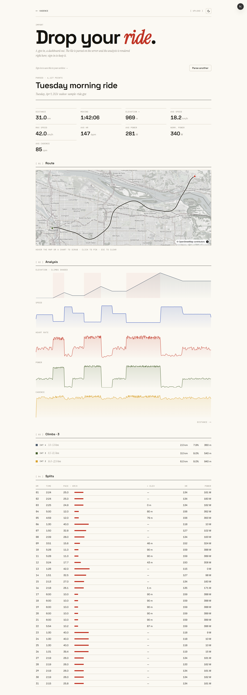
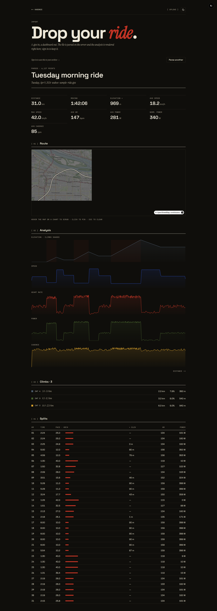

# Kadence

**Editorial cycling-analytics for one rider.**

Kadence is a private, single-user GPX cycling archive. Upload a `.gpx`; the
server parses it into a ride + trackpoints + computed metrics and renders the
result as an editorial dashboard — map, elevation profile, splits, climbs,
charts, and weather. **No feed. No followers. No leaderboards.** An archive, not
a network.



## Screens

|                                                 |                                                          |
| ----------------------------------------------- | -------------------------------------------------------- |
|         |      |
|  |  |

Activity detail in night mode:



> Regenerate these any time with `pnpm dev` in one terminal and `pnpm shots` in
> another (headless Chromium → `docs/screenshots/`).

## What it does

- **GPX-native import** with a from-scratch parser: cumulative haversine
  distance, elevation smoothing + GPS-spike rejection, moving/elapsed time,
  rolling-window max speed, Normalized Power, per-kilometre splits, and
  FIETS-style **climb categorization** (cat 4 → HC).
- **Interactive activity view** — a MapLibre route map and Recharts elevation /
  speed / HR / power / cadence charts, all **linked by a shared cursor**: hover
  the map or any chart to scrub every view (click pins, Esc clears).
- **Private archive** behind magic-link auth — dashboard (this-week stats +
  12-week volume + best efforts), rides list, and activity pages from your saved
  rides.
- **Trends** — 52-week volume, effort distribution across intensity zones, and
  personal-record best efforts.
- **Goals** — weekly/monthly/yearly distance, elevation, time, and best-20-minute
  power targets with progress dials.
- **Settings** — metric ↔ imperial everywhere, light/night theme, FTP + max HR,
  weather toggle, JSON export, and a danger zone (reset demo / delete archive).
- **Weather** — Open-Meteo enrichment per ride.
- **Portfolio-grade** — empty states, error states, **dark mode**, reduced-motion
  guards, and a seeded demo archive.
- **Public demo** — `/upload` parses a `.gpx` in-memory and renders the full
  activity view with no account required.

## Stack

Next.js 15 (App Router, RSC) · TypeScript (strict) · Tailwind CSS 3.4 ·
shadcn/ui · Zod · **Drizzle + Supabase Postgres** · Supabase Auth (magic link) +
Storage · **MapLibre GL** · Turf.js · `fast-xml-parser` · **Recharts** · Vitest ·
pnpm.

## Local setup

```bash
pnpm install

# Supabase — create a project, then:
cp .env.example .env.local        # fill in URL + anon + service-role + DATABASE_URL
# apply the schema (drizzle/) and the policies in supabase/migrations/ to your DB

pnpm dev                          # http://localhost:3000
```

`.env.local` (gitignored) needs the Supabase URL + anon key, the **service-role**
key, and a pooled **`DATABASE_URL`** (transaction pooler, port 6543). See
`.env.example`.

Quality gates and tooling:

```bash
pnpm lint
pnpm typecheck
pnpm test                         # 31 Vitest unit suites (parser, climbs, splits, units…)
pnpm seed you@example.com         # ~80 demo rides over 52 weeks (needs the secrets)
pnpm fixtures                     # regenerate the test .gpx fixtures
pnpm shots                        # capture README screenshots (dev server must be running)
```

> Uses **pnpm** via Corepack. If `pnpm` isn't on your PATH, run it as
> `corepack pnpm <cmd>`.

## Architecture

- **Routes + RSC** — App Router. Server Components by default; client only for the
  map, charts, and forms. Auth is magic-link via `@supabase/ssr` with session
  refresh in `middleware.ts`; the `(app)` group is gated in its layout. Mutations
  are server actions (`app/actions/`).
- **Parsing pipeline** — `lib/gpx/parse.ts` normalizes trackpoints, then derives
  metrics, splits, and climbs (`lib/gpx/{metrics,splits,climbs,smoothing}.ts`).
  The same `PreviewRide` shape powers both the in-memory demo and stored rides
  (`lib/db/ride-view.ts`), so the activity view is reused verbatim.
- **Data** — Drizzle schema in `lib/db/schema.ts`; **row-level security** on every
  table (own-rows-only) with a private `gpx/<userId>/` storage bucket. Drizzle
  connects over the pooler and so always filters by `profileId` in code; RLS is
  the backstop. Aggregations live in `lib/db/queries.ts`.
- **Units** — a single `useUnits()` hook (`components/units-provider.tsx`) reads
  `profile.units`; nothing formats inline.

## Roadmap

- FIT file import
- Strava OAuth import (opt-in)
- Route planning via OpenRouteService
- Public ride sharing (per-ride permalinks)

## Credits

Map tiles © OpenStreetMap contributors. Weather © Open-Meteo.
